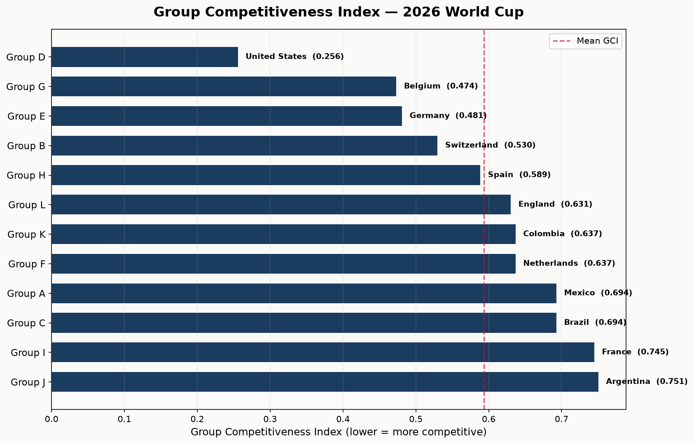
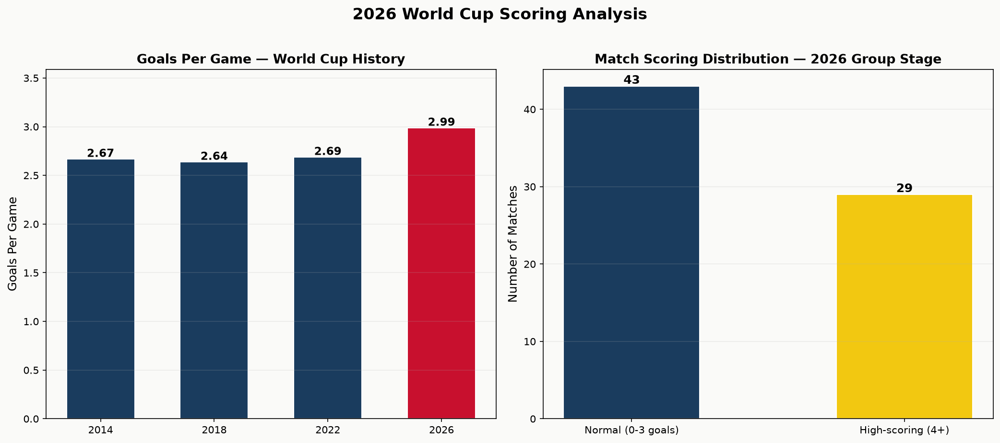
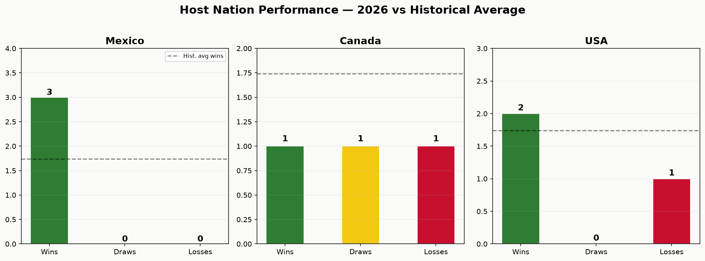
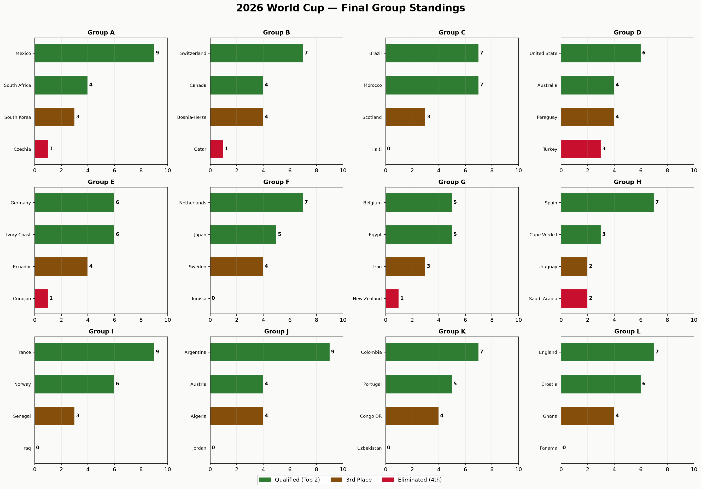
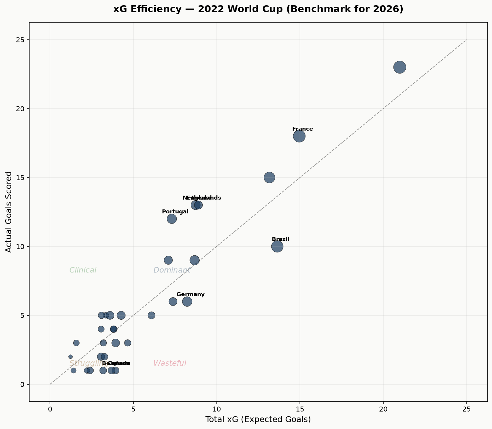
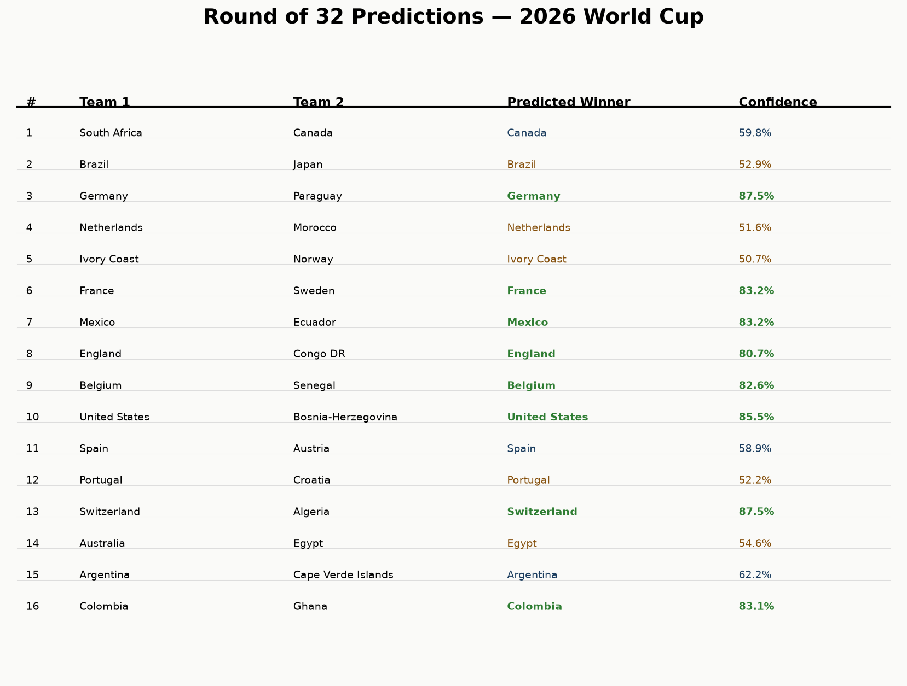
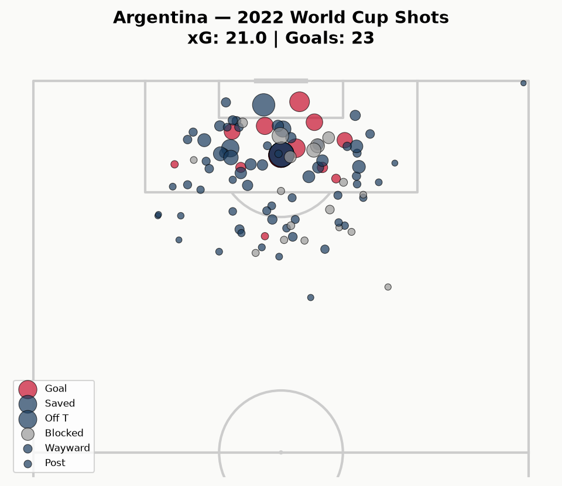
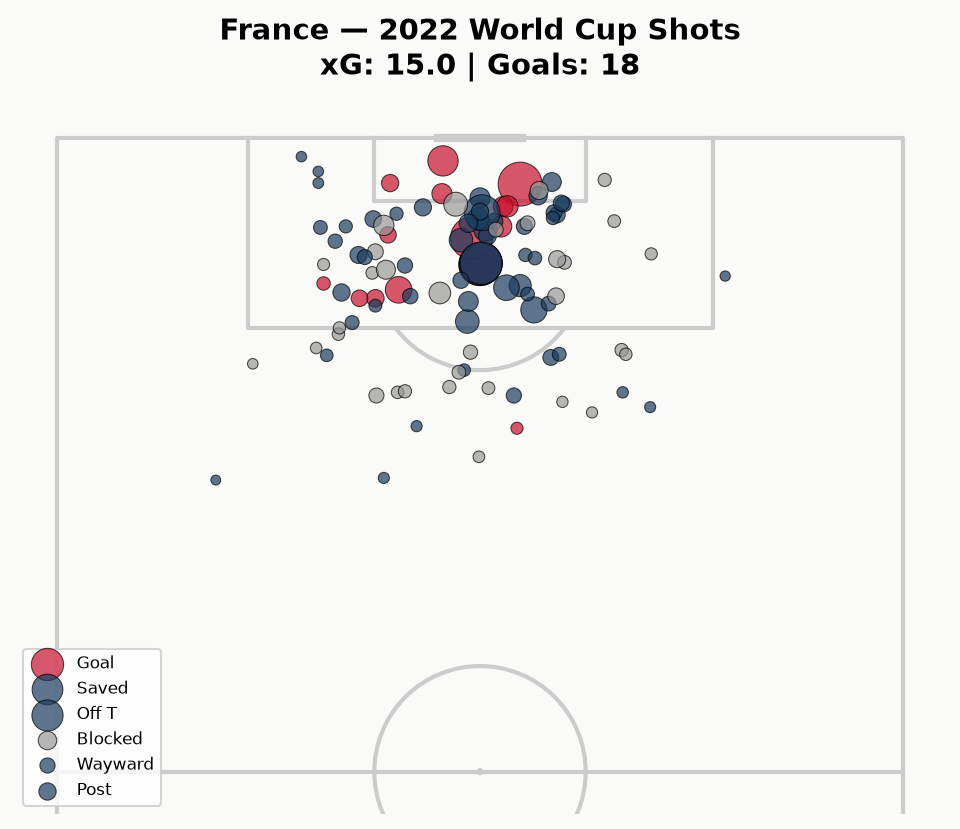
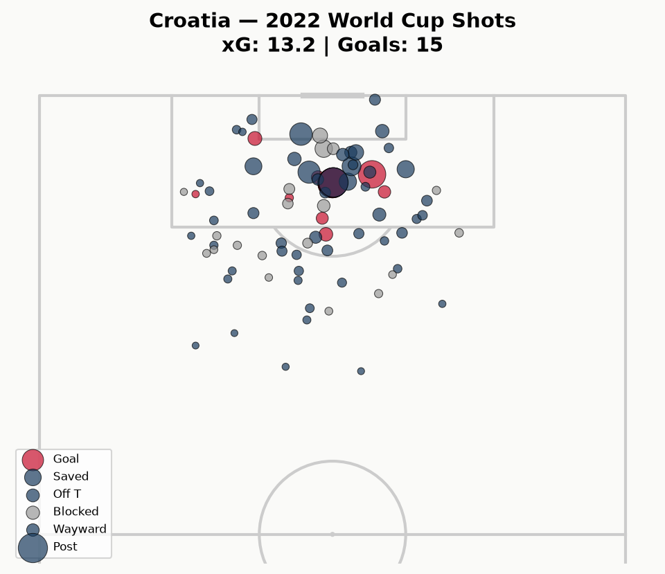
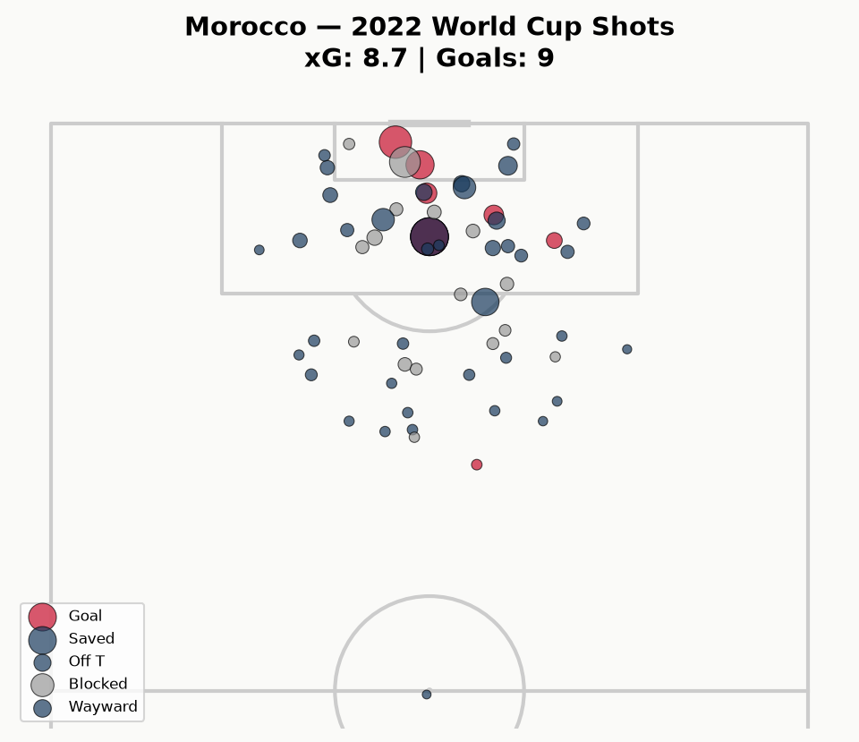

<div align="center">

# ⚽ Beyond the scoreline-FIFA world cup 2026 match prediction and analysis

### Live data pipeline · Original competitiveness metric · xG benchmarking · Knockout prediction model

An end-to-end football analytics project covering all **104 matches** of the 2026 World Cup: a live-refreshing data pipeline, an original Group Competitiveness Index, xG benchmarking against StatsBomb data, a knockout-stage prediction model, and an interactive multi-page Streamlit dashboard.

<br>


</div>

---
## 🛠 Tech Stack

| Component | Technology |
|---|---|
| **Language** | Python 3.11 |
| **Dashboard** | Streamlit (multi-page) + hand-written CSS |
| **Interactive charts** | Plotly |
| **Static charts & pitch plots** | matplotlib, mplsoccer |
| **Data ingestion** | requests · football-data.org API v4 |
| **Data processing** | pandas, numpy |
| **xG data** | statsbombpy (StatsBomb open data) |
| **Modelling** | scikit-learn — LogisticRegression, StandardScaler |
| **Config** | python-dotenv |

---


## 🌍 Overview

This project ingests match results from the [football-data.org](https://www.football-data.org/) API v4, runs them through five sequential analysis stages, and surfaces the output in a custom-styled multi-page Streamlit dashboard.

The pipeline was built to refresh after each match day, so figures updated as the tournament progressed. It now covers the **complete tournament** — all 104 matches from the group stage through the final.

The 2026 edition was the first with the expanded **48-team, 12-group format**, which makes it a genuinely new analytical problem: eight third-placed teams advance to a Round of 32, and the winner plays 8 matches instead of 7.

**Five analysis stages:**

| Stage | Script | What it does |
|---|---|---|
| 1 | `01_data_pipeline.py` | Fetches and cleans match data from the API |
| 2 | `02_group_analysis.py` | Builds standings and computes the Group Competitiveness Index |
| 3 | `03_xg_analysis.py` | Pulls StatsBomb 2022 event data for xG benchmarking |
| 4 | `04_prediction_model.py` | Trains a logistic-regression model and predicts the Round of 32 |
| 5 | `05_visualization.py` | Renders all charts and shot maps to `outputs/` |

---

## 🏆 Tournament Result

**🇪🇸 Spain are World Champions**, beating 🇦🇷 Argentina 1–0 in the final on 19 July 2026.

### Knockout bracket — Quarter-finals onward

| Stage | Date | Match | Result |
|---|---|---|---|
| QF | 2026-07-09 | 🇫🇷 France vs 🇲🇦 Morocco | **2–0** |
| QF | 2026-07-10 | 🇪🇸 Spain vs 🇧🇪 Belgium | **2–1** |
| QF | 2026-07-11 | 🇳🇴 Norway vs 🏴󠁧󠁢󠁥󠁮󠁧󠁿 England | 1–**2** |
| QF | 2026-07-12 | 🇦🇷 Argentina vs 🇨🇭 Switzerland | **3–1** |
| SF | 2026-07-14 | 🇫🇷 France vs 🇪🇸 Spain | 0–**2** |
| SF | 2026-07-15 | 🏴󠁧󠁢󠁥󠁮󠁧󠁿 England vs 🇦🇷 Argentina | 1–**2** |
| 3rd place | 2026-07-18 | 🇫🇷 France vs 🏴󠁧󠁢󠁥󠁮󠁧󠁿 England | 4–**6** |
| **Final** | 2026-07-19 | 🇪🇸 **Spain** vs 🇦🇷 Argentina | **1–0** |

The third-place playoff finished **6–4** to England — ten goals, the highest-scoring match of the knockout rounds.

---

## 🔑 Key Findings

| Metric | Value |
|---|---|
| Total matches analysed | **104** (72 group + 32 knockout) |
| Total goals | **333** |
| Goals per game — whole tournament | **3.20** |
| Goals per game — group stage | **2.99** (vs 2.69 across all of WC 2022) |
| Goals per game — knockout rounds | **3.69** |
| Most competitive group | **Group D** · GCI = 0.2564 |
| Least competitive group | **Group J** · GCI = 0.7510 |
| Champion | 🇪🇸 Spain |
| Model accuracy, Round of 32 | **81.2%** (13/16) |

### The host nations

All three hosts reached the Round of 32 — and all three went out in the Round of 16.

| Host | Group record | Group finish | R32 | R16 |
|---|---|---|---|---|
| 🇲🇽 Mexico | 3W–0D–0L (9 pts, 6–0 GD) | 1st, Group A | beat Ecuador 2–0 | lost 2–3 to England |
| 🇺🇸 USA | 2W–0D–1L (6 pts) | 1st, Group D | beat Bosnia-Herzegovina 2–0 | lost 1–4 to Belgium |
| 🇨🇦 Canada | 1W–1D–1L | 2nd, Group B | beat South Africa 1–0 | lost 0–3 to Morocco |

Combined host win rate across the group stage was **66.7%**, above the ~58% historical host average. Mexico were the only team in the tournament to finish the group stage with a clean sheet (6 scored, 0 conceded).

---

## 📐 The Group Competitiveness Index

An original metric built for this project to quantify how evenly matched each group was.

```
GCI = std(points) / mean(points)
```

**Lower GCI → more competitive group.** A high GCI means a dominant winner pulled away from the pack. Using the coefficient of variation rather than raw spread makes the figure comparable across groups with different scoring levels.

| Group | GCI | Winner Pts | Lowest Pts | Spread | Winner | Runner-up |
|:-----:|:---:|:---:|:---:|:---:|---|---|
| D | **0.2564** | 6 | 3 | 3 | 🇺🇸 United States | 🇦🇺 Australia |
| G | 0.4738 | 5 | 1 | 4 | 🇧🇪 Belgium | 🇪🇬 Egypt |
| E | 0.4815 | 6 | 1 | 5 | 🇩🇪 Germany | 🇨🇮 Ivory Coast |
| B | 0.5303 | 7 | 1 | 6 | 🇨🇭 Switzerland | 🇨🇦 Canada |
| H | 0.5890 | 7 | 2 | 5 | 🇪🇸 Spain | 🇨🇻 Cape Verde Islands |
| L | 0.6308 | 7 | 0 | 7 | 🏴󠁧󠁢󠁥󠁮󠁧󠁿 England | 🇭🇷 Croatia |
| K | 0.6374 | 7 | 0 | 7 | 🇨🇴 Colombia | 🇵🇹 Portugal |
| F | 0.6374 | 7 | 0 | 7 | 🇳🇱 Netherlands | 🇯🇵 Japan |
| A | 0.6935 | 9 | 1 | 8 | 🇲🇽 Mexico | 🇿🇦 South Africa |
| C | 0.6935 | 7 | 0 | 7 | 🇧🇷 Brazil | 🇲🇦 Morocco |
| I | 0.7454 | 9 | 0 | 9 | 🇫🇷 France | 🇳🇴 Norway |
| J | **0.7510** | 9 | 0 | 9 | 🇦🇷 Argentina | 🇦🇹 Austria |

**Group D** — the USA's group — was the tightest, with every team inside 3 points. Groups I and J were dominated by France and Argentina, who each took a perfect 9 points.

### What GCI does *not* measure

Worth stating plainly, because it's the most interesting thing the finished tournament revealed about the metric: **GCI describes a group's internal balance, not the strength of the teams in it.**

- Argentina and France came out of the two *least* competitive groups (GCI 0.7510 and 0.7454) — and finished 2nd and 4th overall.
- Spain won the whole tournament from Group H, a mid-table 0.5890.
- The USA topped the most competitive group in the tournament and were knocked out 1–4 in the Round of 16.

A low GCI means the group was fun to watch. It says nothing about who was any good.

---

## 🤖 Prediction Model — and How It Actually Did

A logistic-regression classifier predicting which team advances from each Round of 32 tie.

**Setup**
- **Model:** `LogisticRegression` (scikit-learn) with `StandardScaler`
- **Features (4):** group-stage goal difference, group position, host status, group points
- **Training data:** hand-coded group-stage records from the 2018 and 2022 World Cups (32 samples)
- **Target:** whether a team advanced past the round

**Result: 13 of 16 correct — 81.2%.**

| Confidence band | Correct |
|---|---|
| High (≥80%) | 7 / 8 |
| Coin-flip (<60%) | 5 / 7 |
| **Overall** | **13 / 16 (81.2%)** |

### The three misses

| Tie | Predicted | Confidence | Actual |
|---|---|---|---|
| 🇩🇪 Germany vs 🇵🇾 Paraguay | Germany | **87.5%** | Paraguay won **5–4** |
| 🇳🇱 Netherlands vs 🇲🇦 Morocco | Netherlands | 51.6% | Morocco won **4–3** |
| 🇨🇮 Ivory Coast vs 🇳🇴 Norway | Ivory Coast | 50.7% | Norway won **2–1** |

Two of the three misses were near coin-flips the model had no real conviction on. The one genuine failure was **Germany at 87.5% confidence**, beaten 5–4 by Paraguay in a nine-goal tie — exactly the kind of high-variance shootout that four group-stage aggregate features cannot see coming.

The model also read the two eventual finalists correctly at modest confidence: Spain at 58.9% and Argentina at 62.2%. Both advanced, and both went on to the final.

---

## 📊 xG Benchmarking

StatsBomb's open event data for the **2022** World Cup is used as the expected-goals benchmark: 32 teams, with shot-level data aggregated into total xG for and against, xG per shot, and over/under-performance against actual goals.

This is a deliberate benchmark rather than live 2026 xG — StatsBomb's official 2026 event data is not released until after the tournament. See [Limitations](#-limitations--honest-notes).

Shot maps are rendered with `mplsoccer` for the four 2022 semi-finalists: Argentina, France, Croatia, and Morocco.

---

## 📈 Visualizations

All charts are generated by `05_visualization.py` into `outputs/`.

<table>
  <tr>
    <td width="50%" align="center"><b>Group Competitiveness Index</b><br></td>
    <td width="50%" align="center"><b>Goals Per Game</b><br></td>
  </tr>
  <tr>
    <td width="50%" align="center"><b>Host Nation Performance</b><br></td>
    <td width="50%" align="center"><b>Final Group Standings</b><br></td>
  </tr>
  <tr>
    <td width="50%" align="center"><b>xG Efficiency — 2022 Benchmark</b><br></td>
    <td width="50%" align="center"><b>Round of 32 Predictions</b><br></td>
  </tr>
</table>

### Shot maps — 2022 semi-finalists

<table>
  <tr>
    <td width="50%" align="center"><b>🇦🇷 Argentina</b><br></td>
    <td width="50%" align="center"><b>🇫🇷 France</b><br></td>
  </tr>
  <tr>
    <td width="50%" align="center"><b>🇭🇷 Croatia</b><br></td>
    <td width="50%" align="center"><b>🇲🇦 Morocco</b><br></td>
  </tr>
</table>

---


## 📁 Project Structure

```
el-mundial-26/
├── .streamlit/
│   ├── config.toml              # Dark theme configuration
│   └── secrets.toml.example     # Template for deployed secrets
├── app/
│   ├── app.py                   # Dashboard home
│   ├── data_loader.py           # Cached loaders for processed CSVs
│   ├── style.css                # Custom dark theme
│   ├── components/
│   │   ├── cards.py             # Metric / stat card components
│   │   └── charts.py            # Reusable Plotly chart builders
│   └── pages/
│       ├── 1_Group_Stage.py     # Standings, GCI, group tables
│       ├── 2_Live_Tracker.py    # Match-by-match results tracker
│       ├── 3_xG_Analysis.py     # xG benchmark & shot maps
│       └── 4_Predictions.py     # Model output vs actual results
├── data/
│   ├── raw/                     # API responses (gitignored)
│   └── processed/               # 11 analysis-ready CSVs
├── notebooks/
│   ├── 01_data_pipeline.py
│   ├── 02_group_analysis.py
│   ├── 03_xg_analysis.py
│   ├── 04_prediction_model.py
│   └── 05_visualization.py
├── outputs/                     # 10 rendered charts (PNG)
├── .env.example
├── requirements.txt
└── README.md
```

### datasets

| File | Contents |
|---|---|
| `matches.csv` | All 104 matches — teams, scores, stage, group, derived flags |
| `standings.csv` | Final group-stage table for all 48 teams |
| `gci_analysis.csv` | Group Competitiveness Index per group |
| `team_goals.csv` | Goals scored/conceded per team per stage |
| `team_features.csv` | Model input features for R32 teams |
| `r32_predictions.csv` | Predicted winners with confidence scores |
| `host_nations.csv` | Host performance breakdown |
| `scoring_analysis.csv` | Goals-per-game aggregates |
| `format_analysis.csv` | 48-team format metrics |
| `team_xg_2022.csv` | StatsBomb xG aggregates, 32 teams |
| `shots_2022.csv` | Shot-level data for shot maps |

---

## 🚀 Getting Started

### Prerequisites

- Python 3.11
- A free API key from [football-data.org](https://www.football-data.org/client/register)


## 🙏 Credits

**Built by Nihal M** — [github.com/nihal007-bit](https://github.com/nihal007-bit)

**Data sources**
- Match results — [football-data.org](https://www.football-data.org/)
- Event & xG data — [StatsBomb Open Data](https://github.com/statsbomb/open-data)

Pitch visualisations use [mplsoccer](https://mplsoccer.readthedocs.io/).

<div align="center">

⭐ Star the repo if you found it useful

</div>
